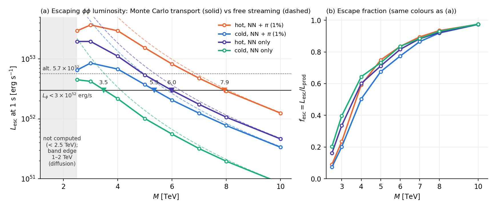

# Supernova bounds on quadratically coupled scalars: $\phi\phi$ pair emission with energy–momentum conservation, the trace channel, pions and transport

*Technical note v2.1, Gravity Innovation project, 27 September 2026. Unrefereed draft for an expert check. Supersedes v1 (26 September 2026); v2.1 replaces the rough $\Delta N_{\rm eff}$ estimate of Section 8 with a Boltzmann calculation.*

> **Provenance.** This analysis was carried out with AI assistance (Claude). Two independent derivations (A and B; scripts in `supernova/sn_A/`, `supernova/sn_B/` of the repository) were reconciled in v1. For v2 an internal referee report was addressed and the key inputs were re-derived with realistic potentials: the trace-channel matrix elements were evaluated exactly at finite $\omega$ with the AV18, Reid93 and Nijmegen-II potentials (`supernova/sn_deep/pw_solver.py`, `trace_tables.py`, `trace_thermal.py`, `trace_degeneracy.py`), cross-checked against a leading-order chiral potential (`chiral_lo_check.py`), and the transport was done by Monte Carlo (`transport_mc.py`, `diffusion_1d.py`). Every number in this note comes from those scripts or from the v1 scripts, re-run for v2; where v2 changes a v1 number, the change is stated. The note has not been refereed. We are asking a supernova or nuclear theorist to check Sections 3, 5 and 6, in that order. Code and outputs: https://github.com/paulwilkerson1985-cmd/gravity-innovation. Contact: Paul Wilkerson (please open an issue on this repository).

---

## Abstract

We compute the energy loss of a proto-neutron star into pairs of a light scalar $\phi$ with a quadratic matter coupling, and state which operator is bounded. For the **universal (conformal) coupling** $\mathcal L=-(\phi^2/2M^2)\,T^\mu{}_\mu$ (the symmetron; also a $d_U=2$ scalar unparticle), energy–momentum conservation gives the exact identity $\Theta(q)=(k_ik_j/\omega^2-\delta_{ij})T^{ij}(q)$: $NN\to NN\phi\phi$ measures only the stress spectral function of the medium, and the $O(m_N/\omega)$ radiation assumed in the 2008 estimate of Olive and Pospelov (OP) is absent. The rate splits into a traceless (quadrupole) channel fixed by on-shell $NN$ data, the pair analogue of the Kaluza–Klein-dilaton result of Hanhart et al. and of the 2007 unparticle estimates, and a trace channel fixed at $\omega\to0$ by the Wigner time delay, $X_{ii}=(1+k\,\partial_k)T_{NN}$. We verify this theorem with the exact finite-$\omega$ matrix element $\langle f|2V+rV'|i\rangle$ for AV18, Reid93 and Nijmegen-II (to 0.5% at 10 MeV and 0.1% above 75 MeV), and find that the pair phase space samples $\omega\sim E$, where the exact element is $1.8$–$1.9\times$ the soft form: the trace/traceless ratio is $K_T^{\rm MB}=12$ (10–13), reduced by Pauli blocking to $6.7$–$8.1$ at the Raffelt point. Pion absorption $\pi^-p\to n\phi\phi$ has no conservation suppression and dominates for $Y_{\pi^-}\gtrsim0.2\%$; its systematics are the largest uncertainty. Monte Carlo transport replaces the semi-trapping guess of v1.

For the universal coupling, $L_\phi(1\,{\rm s})<3\times10^{52}$ erg/s gives $M\gtrsim6$ TeV (5.3 TeV on the cold profile, 7.9 on the hot; 3.5–6.0 without pions; floor 2.2–3.9 from the traceless channel alone), and the excluded region is a band from 1–2 TeV up to $M_{\min}$. For **OP's literal operator** $-(\phi^2/2M^2)\,m_N\bar NN$, which couples neither to pions nor to the nuclear force, the trace channel is $\langle f|V|i\rangle$ ($K_T^{\rm MB}=2.8$–5.3) and the pion channel is $0.22\times$, giving $M\gtrsim4.5$ TeV (3.8–5.8), $\approx0.72\times$ the universal value. Applied to either operator, the 2008 estimate overstates the emissivity by 10–100$\times$. A Boltzmann calculation of the thermal relic (Section 8) gives $\Delta N_{\rm eff}=0.24$ (0.14–0.32) at $M=5$ TeV and 0.17 (0.10–0.27) at 6 TeV; the 2026 BBN+CMB+BAO limit $\Delta N_{\rm eff}<0.107$ then excludes $M\lesssim7.5$ TeV (5.9–9.6) for the universal coupling if the universe reheated above a few GeV. That bound is stronger but depends on the thermal history; the supernova bound does not. The bound holds for the symmetron sign of the coupling; for the opposite sign (Balkin et al.) dense matter sources $\phi$ and the induced linear coupling gives $M\gtrsim10^7$ TeV. The conservation-law suppression was noted in 2007 (Section 9); we have not found an earlier calculation of $\phi\phi$ pair emission that combines it with the trace channel, pions and transport.

---

## 1. Which operator is bounded

We consider a scalar coupled to matter through the Jordan-frame metric $\tilde g_{\mu\nu}=A^2(\phi)g_{\mu\nu}$, $A=1+\phi^2/2M^2$ (Hinterbichler–Khoury symmetron). To first order,

$$
\mathcal L_{\rm univ}=-\frac{\phi^2}{2M^2}\,\Theta,\qquad \Theta\equiv T^\mu{}_\mu\to m_N\bar NN+m_\pi^2\pi^2+\dots\ \text{(on shell)},
\tag{1.1}
$$

and a uniform $A$ rescales every hadronic scale ($m_N,m_\pi,f_\pi,\Lambda_{\rm QCD}$), so the two-nucleon potential transforms as $V_A(r)=A\,V(Ar)$. OP instead couple a dimensionless $\varphi$ to $B_j(\varphi)m_j\bar\psi_j\psi_j$ for $j=n,p,e$ and to $F^2$, with $B_j=1+\xi_j\varphi^2/2$, $\xi_n\simeq\xi_p=1$ "mostly induced by the gluon $B$-function" (their eqs. 2.2–2.4). With $\phi=M_*\varphi$,

$$
\mathcal L_{\rm OP}=-\frac{\phi^2}{2M_*^2}\,m_N\bar NN\ (+\,e,\ F^2\ \text{terms}).
\tag{1.2}
$$

The two agree for free nucleons ($m_N\bar NN=\Theta$ on shell up to $O(p^2/m_N)$) but differ in the medium: (1.2) does not couple to pions or to the interaction energy of the nuclear force.

| | universal (1.1) | OP (1.2) |
|---|---|---|
| traceless (quadrupole) channel | identical | identical |
| trace-channel matrix element | $\langle f|2V+r\,V'|i\rangle$ (time-delay theorem at $\omega\to0$) | $\langle f|V|i\rangle$ |
| $\pi^-p\to n\phi\phi$ | pion-line diagram dominates | nucleon legs only ($0.22\times$) |
| $\gamma\gamma\to\phi\phi$ | trace anomaly, $\xi_F\sim\alpha/\pi$ | $\xi_F$ free |

v1 compared its bound on (1.1) with OP's bound on (1.2); here both are given. Conventions: OP's $M_*$ ($\xi_N=1$) $=M$; Stadnik–Flambaum's $\Lambda'=\sqrt2M$; Balkin et al.'s $M_\phi=M$ with the *opposite sign*. For the symmetron sign dense matter restores the symmetric phase ($\langle\phi\rangle=0$, $m_{\rm eff}\approx36\,{\rm keV}\,({\rm TeV}/M)(\rho/3\times10^{14}\,{\rm g\,cm^{-3}})^{1/2}\ll T$) and only pair processes occur; for the opposite sign dense matter sources $\phi$ and the induced linear coupling gives $M_\phi\gtrsim10^7$ TeV (Appendix B).

---

## 2. Pair emission and the conservation identity

From $\partial_\mu T^{\mu\nu}=0$, for pair four-momentum $q=(\omega,\mathbf k)$, $\kappa=|\mathbf k|/\omega\le1$,

$$
\Theta(q)=\Big(\frac{k_ik_j}{\omega^2}-\delta_{ij}\Big)T^{ij}(q)\equiv P_{ij}T^{ij}(q).
\tag{2.1}
$$

The identity is exact for the full conserved $T^{\mu\nu}$ between exact many-body eigenstates; evaluating it between two-nucleon scattering states is the quasiparticle approximation, whose in-medium corrections ($m^*$, $T$-matrix, LPM) are the residual $NN$ uncertainty. The monopole (baryon number) and dipole (momentum; cancels for equal $n,p$ couplings) are absent; B's relativistic one-pion-exchange check confirms the cancellation diagram by diagram ($|\mathcal M_{\rm rel}|^2/(2m)^4|\Theta_{\rm NR}|^2=1.00\pm0.01$ at $p=30$–60 MeV). Treating the massless pair as one scalar of invariant mass $s=\omega^2(1-\kappa^2)$ with measure $ds/(32\pi^2M^4)$,

$$
Q=\frac{1}{64\pi^4M^4}\int d\omega\,\omega^4\!\int_0^1\!\kappa^2d\kappa\,\big\langle S_\Theta(\omega,\kappa)\big\rangle,\qquad
\langle|P\!:\!X|^2\rangle_{\hat k}=\kappa^4\tfrac{2}{15}X^T\!:\!X^T+\big(1-\tfrac{\kappa^2}{3}\big)^2|X_{ii}|^2,
\tag{2.2}
$$

with no cross term; the $\kappa$ integrals give the weights $2/105$ (traceless) and $68/315$ (trace). The traceless channel, $X^T=T_{NN}(\mathbf k'\mathbf k'-\mathbf k\mathbf k)^T/\mu\omega$, is fixed by $\sigma^{(2)}=\int d\Omega\,(d\sigma/d\Omega)\sin^2\theta$; it is HPRS's KK-dilaton theorem (their eq. 38) summed over a continuum of masses ($\int ds\,\kappa^5\propto1/7$) and the quadrupole term of the 2007 unparticle papers at $d_U=2$ (Section 9). Because the $\omega^4$ phase space pushes emission to $\chi=\omega M/\bar p^2\sim1$, the $O(\chi^0)$ terms that HPRS note are "not constrained by on-shell data and conservation" dominate: that is the trace channel. *Unparticle map:* a $d_U=2$ scalar operator has the flat spectral density $A_2\,d^4P/(2\pi)^4$, $A_2=1/8\pi$, i.e. a free massless pair; matching to $(\lambda_S/\Lambda_U)\bar NN\mathcal O_U$ gives $\lambda_S/\Lambda_U=m_N/\sqrt2M^2$.

---

## 3. The trace channel: time-delay theorem and finite-$\omega$ evaluation

This is the one new theorem the rest hangs on, and it can be checked in an afternoon. Between exact $NN$ eigenstates with $E_f=E_i-\omega$ the source is the scale derivative of the two-body Hamiltonian, $S=dH/dA|_{A=1}=2V+\mathbf r\!\cdot\!\nabla V$ (kinetic term $\to A^{-2}$, potential $\to AV(Ar)$), so

$$
\langle f|X_{ii}|i\rangle\ \propto\ \langle f|\,2V+r\,V'\,|i\rangle ,
\tag{3.1}
$$

exact to all orders in $V$. In the soft limit observables depend on $k/A$ only, and Hellmann–Feynman gives

$$
X_{ii}\big|_{\omega\to0}=(1+k\,\partial_k)T_{NN}\big|_\theta,\quad (1+k\,d/dk)f_\ell=e^{2i\delta_\ell}\delta_\ell'(k),\quad
\sigma_{\rm tr}\equiv\!\int\! d\Omega|X_{ii}|^2=w\pi\sum_J(2J+1)\tfrac14{\rm Tr}\,|dS_J/dk|^2
\tag{3.2}
$$

($w=1$ for $np$, 2 for $nn$): the Wigner time delay. It vanishes in the unitary, scale-invariant limit, as it must, and is the dilatation-operator term of the soft-dilaton theorem (Di Vecchia et al.) applied to nonrelativistic scattering. It needs only the on-shell $S$-matrix but assumes $V_A(r)=AV(Ar)$, i.e. universal rescaling including $\Lambda_{\rm QCD}$: true for (1.1), not for (1.2).

**Check with realistic potentials.** We solved the coupled-channel Schrödinger equation for AV18, Reid93 and Nijmegen-II (all partial waves to $J=4$; PWA93 $np$ phases reproduced to $\lesssim0.5^\circ$ below 300 MeV) and evaluated (3.1) between eigenchannel standing waves on an $E_f\times E_i$ grid. On the diagonal the exact element reproduces (3.2) to 0.5% at $E_{\rm cm}=10$ MeV and 0.1% above 75 MeV, identically for the three potentials and for $nn$, $np$ (Table C1); the residual is the finite-difference step. A leading-order chiral potential with a different short-range form gives the same identity (1.000–1.005). The trace/elastic ratio is $c_{\rm tr}^2=3.0$–3.1 ($nn$), 2.7–2.8 ($np$) for $T_{\rm lab}=150$–350 MeV (v1: 2.3–3.1 from approximate tables).

**Finite $\omega$.** The pair phase space samples $\omega\sim E$, where the exact element exceeds the soft form: per matrix element $1.1$–$1.2\times$ at $\omega/E=0.5$ and $1.7$–$2.1\times$ at $\omega/E=0.8$ (AV18). Thermally (Maxwell–Boltzmann, $\rho=3\times10^{14}$ g cm$^{-3}$, $Y_p=0.3$), with $K_T\equiv Q_{NN}/Q_{\rm traceless}$:

| $T$ [MeV] | $K_T$ v1 (B, $\omega\to0$) | $K_T$ ($\omega\to0$ at $\bar k$, potentials) | $K_T$ exact finite $\omega$ (AV18 / Reid93 / NijmII) | finite/soft |
|---|---|---|---|---|
| 20 | 6.4 | 6.7 | 11.6 / 11.8 / 11.7 | 1.86–1.90 |
| 30 | 6.4 | 6.8–7.2 | 12.2 / 12.3 / 12.1 | 1.82–1.92 |
| 40 | 5.9 | 6.7–7.6 | 12.1 / 11.7 / 11.6 | 1.69–1.86 |

The spread across potentials is $\le3\%$, and holding $\sigma_{\rm tr}$ fixed above $E_{\rm cm}=175$ MeV changes it by $\le3\%$. This confirms A's potential-model range 8–14 and supersedes v1's $K_T=6.5$ (4–14), which was B's soft-limit value. A local LO chiral potential ($R_0=1.0$, 1.2 fm; contacts fitted at 10 MeV) gives a thermal $S$-wave finite/soft ratio of 2.1–2.5 against 3.0–3.1 for AV18; $S$ waves carry 85–90% of the finite-$\omega$ trace channel, so LO-EFT-like short-range dynamics would give $K_T^{\rm MB}\approx10$. **Adopted: $K_T^{\rm MB}=12$ (10–13).** An N$^2$LO/N$^3$LO evaluation with data-quality phases would settle the last $\sim20\%$.

**Degeneracy.** The enhancement lives at large $\omega$ (slow final nucleons) and is Pauli-blocked more strongly than the soft form: Fermi–Dirac/Maxwell–Boltzmann ratios at (30 MeV, $3\times10^{14}$, $Y_p=0.3$) are 0.91–1.00 (traceless; B's v1 value 0.85 was Monte Carlo noise), 0.74–0.89 (soft trace) and 0.55–0.76 (finite-$\omega$ trace). The effective ratio is $K_T^{\rm FD}=6.3$, 8.1, 9.1 at $T=20$, 30, 40 MeV, 7.0 and 8.4 at the cold- and hot-profile temperature peaks (Table C2). With the LO-EFT-like lower edge, **$K_T^{\rm FD}=6.7$–8.1 at the Raffelt point and 7–10 in the emitting zones.** The residual trace-channel uncertainty is now the in-medium physics, not the $\omega$ dependence.

**OP's operator.** Replacing $2V+rV'$ by $V$ in the same code (AV18) gives $K_T^{\rm MB}=5.3/3.6/2.8$ at $T=20/30/40$ MeV (finite/soft $=0.75/0.42/0.27$): for (1.2) the finite-$\omega$ corrections *reduce* the trace channel.

---

## 4. $NN$ emissivity

At $\rho=3\times10^{14}$ g cm$^{-3}$, $Y_p=0.3$, $M=1$ TeV, with the AV18 finite-$\omega$ trace channel and Fermi–Dirac statistics (erg g$^{-1}$s$^{-1}$; inputs in Appendix C):

| $T$ [MeV] | $\epsilon_{\rm OP}$ | $\epsilon_T^{\rm FD}$ (traceless) | $\epsilon_{\rm tr}^{\rm FD}$ (trace) | $K_T^{\rm FD}$ | $\epsilon_{NN}^{\rm FD}$ | v1 ($6.5\,\epsilon_T$) | $M_{\min}$ (Raffelt): OP / traceless / $NN$ [TeV] |
|---|---|---|---|---|---|---|---|
| 20 | $1.15\times10^{23}$ | $7.9\times10^{19}$ | $4.1\times10^{20}$ | 6.3 | $4.9\times10^{20}$ | $5.1\times10^{20}$ | 10.4 / 1.7 / 2.65 |
| 30 | $4.76\times10^{23}$ | $6.6\times10^{20}$ | $4.7\times10^{21}$ | 8.1 | $5.4\times10^{21}$ | $4.3\times10^{21}$ | 14.8 / 2.9 / 4.8 |
| 40 | $1.30\times10^{24}$ | $3.0\times10^{21}$ | $2.4\times10^{22}$ | 9.1 | $2.7\times10^{22}$ | $1.9\times10^{22}$ | 19.0 / 4.2 / 7.2 |

A fit to nine grid points ($T=20$–42 MeV, $\rho=(1$–$4.4)\times10^{14}$, $Y_p=0.12$–0.3; `nn_emissivity_new.json`), good to $\sim15\%$:

$$
\epsilon_{NN}^{\rm FD}\simeq5.4\times10^{21}\ {\rm erg\,g^{-1}s^{-1}}\Big(\frac{\rho}{3\times10^{14}}\Big)^{0.75}\Big(\frac{T}{30\,{\rm MeV}}\Big)^{5.7}g(Y_p)\Big(\frac{\rm TeV}{M}\Big)^4,
\quad g=0.40\Big(\frac{1-Y_p}{0.7}\Big)^2+0.51\,\frac{Y_p(1-Y_p)}{0.21}+0.09\Big(\frac{Y_p}{0.3}\Big)^2 .
\tag{4.1}
$$

At identical conditions OP's estimate overstates the $NN$ emissivity by $\approx700\times$ (traceless only) or $\approx90\times$ (total, 30 MeV). The $NN$-only Raffelt-point bound is **4.6–4.8 TeV** (v1: 4.6).

---

## 5. Pion-induced emission and its systematics

A thermal $\pi^-$ that is absorbed gives up its rest energy and its scalar charge ($\langle\pi|\Theta|\pi\rangle\ni2m_\pi^2$), so $\pi^-p\to n\phi\phi$ has no conservation suppression and the pair carries $\langle\omega\rangle\approx170$–210 MeV. A and B evaluate the same tree-level Lagrangian in two field bases and agree to $\le5\%$ before final-state blocking (Appendix A); in A's basis the pion-line diagram dominates, and for OP's operator only the nucleon legs remain, $0.22\times$. With B's computed final-neutron blocking factor $B(T)$,

$$
\epsilon_\pi\simeq5.9\times10^{22}\,B(T)\ {\rm erg\,g^{-1}s^{-1}}\Big(\frac{Y_{\pi^-}}{1\%}\Big)\Big(\frac{Y_p}{0.3}\Big)\Big(\frac{\rho}{3\times10^{14}}\Big)\Big(\frac{T}{30\,{\rm MeV}}\Big)^{1.9}\Big(\frac{\rm TeV}{M}\Big)^4,
\quad B=0.39,\ 0.59,\ 0.70\ \text{at}\ T=20,30,40\ {\rm MeV}.
\tag{5.1}
$$

v1 used a flat $B=0.7$. At (30 MeV, $3\times10^{14}$), $Q_\pi/Q_{NN}\approx6.4\,(Y_{\pi^-}/1\%)$, so pions dominate for $Y_{\pi^-}\gtrsim0.2\%$. The transport runs of Section 6 used the flat factor; (5.1) lowers the cold-profile central bound by $\approx3\%$ (that core emits at $T\approx25$–31 MeV) and leaves the hot one unchanged, while the two-body channel below raises both by $\approx3\%$, so the Section 6 values stand to $\pm3\%$.

**Systematics, ranked.** (1) *Abundance.* Ideal gas: $Y_{\pi^-}=0.1$–0.5%; virial (Fore–Reddy 2020): 1–5%; Carenza et al. 2021: 1.1% at 1 s. Fore, Kaiser, Reddy and Warrington (2024) find in chiral perturbation theory that the $\pi^-$ mass *rises* with density in neutron-rich matter, the opposite of the $p$-wave softening behind the larger abundances; we keep $Y_{\pi^-}(37\,{\rm MeV})\in[0.3,3]\%$, central 1%, shape $\exp[-(m_\pi-80\,{\rm MeV})(1/T-1/37)]$, but the range is skewed low. $M_{\min}\propto Y_\pi^{1/4}$: $\times0.75$–1.3. $Y_\pi$ also peaks later than 1 s. (2) *Blocking*, 0.39–0.70 in (5.1). (3) *In-medium propagator.* The dominant pion-line diagram propagates an off-shell pion with $|\mathbf q|\sim150$ MeV, where the $\Delta$-hole self-energy is $O(1)$; the open item on the rate per pion, $\times0.5$–2. (4) *Two-body absorption bremsstrahlung.* $\pi^-np\leftrightarrow nn$ and $NN\leftrightarrow NN\pi$ change the scalar charge by $\Delta S\approx290\,{\rm MeV}-\omega$ and are not conservation-suppressed; a sudden-approximation estimate with pionic-atom widths ($\Gamma_{\rm abs}\approx50$ MeV at $3\times10^{14}$) gives $5.6\times10^{21}(Y_\pi/1\%)$ erg g$^{-1}$s$^{-1}$ at 1 TeV, **13% of the one-body channel** ($+3\%$ in $M$); not in the tables. (5) *Others.* $\pi N\to\pi N\phi\phi$ $\sim7\%$; $\pi\pi\to\phi\phi$ (vertex $2m_\pi^2+s$, $n_{\pi^0}/n_p\approx4\times10^{-4}$): a few per cent, not v1's $10^{-3}$; $\Delta(1232)$: $\lesssim1\%$ (no tree-level $\Delta$ pole, $\Theta$ being diagonal in the baryon basis); $e^\pm$: $(m_e/T)^2$; $\gamma\gamma$: $\xi_F\sim\alpha/\pi$.

---

## 6. Transport

The only $\phi N$ vertex in the symmetric phase is the contact term, $\sigma_{\phi N}=m_N^2/4\pi M^4=2.7\times10^{-41}\,{\rm cm^2}({\rm TeV}/M)^4$, giving a central optical depth $\tau_c\approx30$ at $M=4$ TeV and $\approx2$ at 8 TeV. v1 applied a hand factor $M_{\min}\times(0.85$–0.95). v2 uses a Monte Carlo (`transport_mc.py`): pairs produced from $Q(r)=Q_{NN}+Q_\pi$ with the channel spectra ($\langle\omega_{\rm pair}\rangle=6T$ for $NN$, 190 MeV for pions) are random-walked through the profile with elastic contact scattering (full kinematics against Maxwellian nucleons, so the spectrum degrades toward the local $T$) and detailed-balance re-absorption, $\Gamma_{\rm abs}=Q/u_{\rm BB}$. A flux-limited diffusion solve without degradation (`diffusion_1d.py`) covers $M=1$–10 TeV.

| profile, channels | $M$ [TeV] | $\tau_c$ | $f_{\rm esc}=L_{\rm esc}/L_{\rm prod}$ | $\langle E_{\rm esc}\rangle/\langle E_{\rm prod}\rangle$ | $M_{\min}$, $L_{\rm esc}<3\times10^{52}$ (free-streaming) | $<5.7\times10^{52}$ |
|---|---|---|---|---|---|---|
| cold, $NN$ only | 4 / 5 / 6 | 33 / 13 / 6.5 | 0.64 / 0.73 / 0.84 | 0.67 / 0.74 / 0.84 | **3.5** (4.1) | none for $M\ge2.5$ (free-streaming 3.5) |
| cold, $NN+\pi$ (1%) | 4 / 5 / 6 | 33 / 13 / 6.5 | 0.50 / 0.68 / 0.77 | 0.63 / 0.71 / 0.78 | **5.3** (5.8) | 4.3 (5.0) |
| hot, $NN$ only | 4 / 5 / 6 | 29 / 12 / 5.7 | 0.60 / 0.71 / 0.82 | 0.63 / 0.72 / 0.82 | **6.0** (6.3) | 4.9 (5.4) |
| hot, $NN+\pi$ (1%) | 5 / 6 / 8 | 12 / 5.7 / 1.8 | 0.75 / 0.84 / 0.94 | 0.78 / 0.84 / 0.94 | **7.9** (8.1) | 6.7 (6.9) |

Energy degradation dominates; re-absorption (0.2 of the pairs at 4 TeV on the cold profile with pions, $<0.01$ above 6 TeV) matters only below $M\approx4$ TeV. The self-consistent bounds are $\times0.92$ (cold) to 0.98 (hot) of the free-streaming values for the central case and $\times0.85$–0.95 for $NN$ only, confirming and sharpening the v1 guess.

*Figure 1.* (a) Escaping $\phi\phi$ luminosity at 1 s from the Monte Carlo transport (solid, points) and for free streaming $L_{\rm prod}/M^4$ (dashed), for the cold and hot profiles with and without pions ($Y_{\pi^-}=1\%$), against $L_\phi<3\times10^{52}$ erg/s (solid line; $5.7\times10^{52}$ dotted). Triangles mark the self-consistent $M_{\min}$; the shaded region ($M<2.5$ TeV) was not computed with the Monte Carlo; there the diffusion solve puts the lower edge of the excluded band at 1–2 TeV. (b) The escape fraction. Data: `figures/fig1_data_v2.json` from `supernova/sn_deep/transport_mc.json`; script `figures/make_fig1_v2.py`.

**Lower edge of the band.** The diffusion solve gives $L_{\rm esc}/3\times10^{52}=1.2$ (cold, $NN$ only) to 3.9 (hot) at $M=1$ TeV, rising to $\times4$–30 at $M=2$–2.5 TeV; with degradation (Monte Carlo, $M\ge2.5$) the cold $NN$-only case is only $\times1.4$–1.5 above the limit at 2.5–3 TeV. **The excluded band extends down to 1–2 TeV**, profile dependent. v1's criterion ("$\lambda_\phi\le\lambda_\nu$, so $\phi$ carries a neutrino species' luminosity") was wrong: as for $\nu_\mu,\nu_\tau$, the $\phi$ energy sphere ($t_{\rm abs}<t_{\rm diff}$; 10.5–15 km, $T=16$–42 MeV at $M=1$–3 TeV) lies far inside the scattering sphere ($\tau=2/3$ at 15–24 km, $T=4$–19 MeV), and a blackbody at the energy sphere overestimates $L_{\rm esc}$ by $18$–$32\times$ because the flux is diffusion-limited by the scattering atmosphere outside it (Raffelt 1996). Below $\sim1$ TeV a hydrodynamic treatment is needed; that region lies outside the band of interest.

---

## 7. Bounds

Criteria: $\epsilon<10^{19}$ erg g$^{-1}$s$^{-1}$ at (30 MeV, $3\times10^{14}$ g cm$^{-3}$, $Y_p=0.3$) (Raffelt point) and $L_\phi(1\,{\rm s})<3\times10^{52}$ erg/s (alternative $5.7\times10^{52}$) on two parametrized 1-s profiles from published figures ("cold": $1.41M_\odot$, $T_{\max}=31.5$ MeV; "hot": $1.33M_\odot$, 42.5 MeV). No public 1-s profile could be obtained (Appendix C); the $\times1.35$ spread between profiles is the leading "profile" error, and both kinds of result are quoted with equal weight.

**Final numbers** (TeV):

| Quantity | universal operator (1.1) | OP's operator (1.2) |
|---|---|---|
| **central**: $NN$ ($K_T^{\rm FD}=7$–10) $+\ \pi$ ($Y_{\pi^-}=1\%$), profiles, with transport | **5.3 (cold) / 7.9 (hot)**, i.e. $\gtrsim6$; 4.3 / 6.7 for $L<5.7\times10^{52}$ | **3.8 / 5.8**, i.e. $\approx4.5$ ($0.72\times$) |
| central, Raffelt point (free streaming) | 8.0–8.2 | 5.6–5.8 |
| **$NN$ only**, profiles, with transport | **3.5 / 6.0** | 2.8 / 4.9 |
| $NN$ only, Raffelt point | 4.6–4.8 | 3.9–4.0 |
| **floor**: traceless channel only, profiles / Raffelt point | **2.2–3.9** / 2.9 ($\times0.9$–0.95 with transport) | same |
| lower edge of the excluded band | 1–2 (profile dependent) | 1–2 |
| OP 2008 formula, same profiles / Raffelt point | 13.2 / 16.9 / 14.8 | same |

The OP column rescales the universal one by the channel ratios of Sections 3 and 5 ($NN$ rate $\times0.35$–0.45, pion rate $\times0.22$; pions supply 63–75% of $L$ in the central case), i.e. $M\times0.71$–0.74 (central) and $\times0.8$ ($NN$ only). **Standard statement:** *for the universal (symmetron) coupling, $M\gtrsim6$ TeV (5.3–7.9 across profiles), 3.5–6 TeV without pions, floor 2.2–3.9 TeV; for OP's literal operator $M\gtrsim4.5$ TeV (3.8–5.8); the excluded region is a band from 1–2 TeV up to $M_{\min}$.* The number to defend in print is 5–6 TeV (universal). OP's estimate, applied to either operator, overstates the emissivity by 10–100$\times$ (with pions / $NN$ only).

**Uncertainty budget for the central universal bound** (factors on $M_{\min}$, roughly independent, ranked):

| rank | input | range | effect on $M_{\min}$ |
|---|---|---|---|
| 1 | $Y_{\pi^-}$ and in-medium pion physics (2024 mass shift, $\Delta$-hole propagator, blocking 0.4–0.7) | $\times0.3$–3 in rate | **$\times0.75$–1.3** |
| 2 | PNS profile (cold vs hot; one 1-s snapshot; criterion 3 vs $5.7\times10^{52}$) | $\times1.35$ between profiles; $\times0.85$ criterion | **$\times0.8$–1.2** |
| 3 | in-medium $NN$ ($m^*$, $T$-matrix, LPM) on the trace channel | $\times0.5$–2 in rate | $\times0.85$–1.2 ($NN$ only); $\times0.95$–1.05 (central) |
| 4 | $K_T$: finite-$\omega$ short-range model dependence | 10–13 (MB) | $\times0.95$–1.02 |
| 5 | transport (degradation, re-absorption; production spectra $\pm30\%$) | Monte Carlo done | $\times0.97$–1.03 |
| 6 | two-body pion bremsstrahlung, $\pi\pi\to\phi\phi$, $\Delta$ | $+10$–15% in rate | $\times1.03$ |
| — | operator identity (universal vs nucleon-only) | — | $\times0.72$ |

---

## 8. Cosmological bound: thermal relic and $\Delta N_{\rm eff}$

The same operator keeps $\phi$ in thermal contact with the early-universe plasma, where the symmetron is in its symmetric phase with $m_{\rm eff}^2=(\rho-3p)/M^2\ll T^2$: one light real scalar. v2 used an instantaneous-decoupling estimate; v2.1 replaces it with a two-moment Boltzmann calculation for $n_\phi$ and $\rho_\phi$ (`cosmology/neff_proper/` in the repository), integrated from 50 GeV to 5 MeV with the Saikawa–Shirai $g_{*s}(T)$. The pair-production rate is $\gamma=(16\pi M^4)^{-1}\int d^4q\,(2\pi)^{-4}\,\Pi^>_\Theta(q)\,\theta(q^2)$. Above the QCD crossover it is carried by the gluon trace anomaly $(b_0\alpha_s/8\pi)G^2$ and heavy quarks. Below it, $\pi\pi\to\phi\phi$ dominates, with the vertex $\langle0|\Theta|\pi\pi\rangle=s+2m_\pi^2$ of the low-energy theorem (Voloshin–Zakharov; Donoghue–Gasser–Leutwyler), Omnès-unitarized, plus $K$ and $\eta$ (the same vertex as the pion channel of Section 5). For $M=5$ TeV, $\Gamma/H$ stays at 0.2–0.6 from about 100 to 300 MeV. So $\phi$ never decouples sharply: it stays partly coupled through the crossover and shares in its entropy release, which the instantaneous criterion misses.

| $M$ (TeV) | 3 | 4 | 5 | 6 | 8 | 10 |
|---|---|---|---|---|---|---|
| $\Delta N_{\rm eff}$, central | 0.35 | 0.30 | 0.24 | 0.17 | 0.094 | 0.067 |
| band | 0.30–0.38 | 0.21–0.35 | 0.14–0.32 | 0.10–0.27 | 0.07–0.16 | 0.056–0.10 |

*Band:* the envelope over hadronic-rate variants (LO ChPT to $\times3$), QGP rate $\times0.5$–3, the $\alpha_s$ scale, $T_c$ and crossover width, $g_{*s}\pm1\sigma$, and energy exchange with and without elastic scattering.

**Limits.** The combined BBN (D, $^4$He) + Planck + ACT + SPT + DESI DR2 analysis gives $N_{\rm eff}=2.990\pm0.070$, i.e. $\Delta N_{\rm eff}<0.107$ at 95% (Goldstein & Hill 2026). Against it the calculation excludes $M\lesssim7.5$ TeV (5.9–9.6 across the band). CMB-only limits give 6.8 TeV ($<0.13$, CMB-SPA) and 6.1 TeV ($<0.16$, ACT DR6), and the pre-2025 Planck+BAO limit ($<0.30$) gives 4.1 TeV. BBN- and CMB-epoch values coincide, since $\phi$ decouples at $T\gg1$ MeV.

**Uncertainties.** The dominant one is the $\pi\pi$ trace form factor at $\sqrt s\approx0.5$–1 GeV ($\pm1.7$ TeV in $M$). A dispersive two-channel ($\pi\pi$, $K\bar K$) form factor would reduce it. QCD-crossover modelling moves $M$ by only $\pm0.3$ TeV.

**Caveats.**

- *Reheating.* The bound assumes a standard thermal history. The thermal value of $\Delta N_{\rm eff}$ is reached for $T_{\rm RH}\gtrsim200$ MeV at $M=4$–5 TeV, but only for $T_{\rm RH}\gtrsim1$–3 GeV at $M=6$–8 TeV, where QGP-phase production matters. The excluded $M$ is therefore 7.5 TeV for $T_{\rm RH}\gtrsim3$ GeV, 7.3 at 1 GeV, 6.2–6.6 at 0.2–0.5 GeV and 4.5 at 100 MeV, below the supernova bound. BBN itself needs only $T_{\rm RH}\gtrsim5$ MeV, and late entropy injection also weakens the bound.
- *Operator.* The bound applies to the universal coupling only. For (1.2) the pion channel is absent and $\Delta N_{\rm eff}\approx0.05$–0.07, which is not excluded.
- *Relativistic relics.* The relics must be relativistic at recombination, which holds for a symmetron vacuum mass $\lesssim10^{-3}$ eV.

Cosmology is thus the stronger bound under standard assumptions. The supernova bound of Section 7 is the one that holds for any thermal history.

---

## 9. Relation to the literature, and what is new

**The 2007 unparticle papers.** A $d_U=2$ scalar unparticle coupled to $\bar NN$ is a $\phi\phi$ pair with the OP operator (Section 2), so the supernova bounds on $d_U=2$ scalar unparticles are bounds on (1.2). Hannestad, Raffelt and Wong (arXiv:0708.1404) treat the vector coupling $\bar N\gamma_\mu N\mathcal O_U^\mu$, argue that for equal couplings to all nucleons bremsstrahlung is suppressed in the nonrelativistic limit "just as for $e^-e^-\to e^-e^-\gamma$" so that quadrupole radiation with a factor $v^4$ dominates, and scale the graviton-bremsstrahlung rate of Hanhart et al. to $d=1,3/2,2$. Dutta and Goyal (arXiv:0712.0145) treat the scalar coupling $(\lambda_S/\Lambda_U^{d_U-1})\bar ff\mathcal O_U$ explicitly, note that the leading $\pm1/2m_N\omega$ terms from the outgoing and incoming legs "cancel in pairs", and compute the one-pion-exchange rate in degenerate matter for $d_U=1$–2.4, recovering Ishizuka–Yoshimura at $d_U=1$. Freitas and Wyler (arXiv:0708.4339, v3) give the factorized soft-radiation rate for scalar and vector couplings with the same velocity scaling. **So the quadrupole-level correction to OP was available in 2007, for the OP operator.** Numerically, Dutta–Goyal's Fig. 1 gives $\lambda_S(d_U=2,\Lambda_U=m_Z)\approx(1$–$5)\times10^{-6}$ (read off the figure; their text quotes only $d_U=1$ values), which with $\lambda_S/\Lambda_U=m_N/\sqrt2M^2$ is $M\approx3.5$–8 TeV, consistent with our $NN$-only bound for (1.2) (2.8–4.9 TeV; floor 2.2–3.9) within the reading uncertainty and the difference between their degenerate-OPE and our data-driven treatment.

**Other prior art.** The external-leg cancellation for mass-coupled scalars: Ishizuka–Yoshimura, Arndt–Fox, Keung–Ng–Tu–Yuan and Tu–Ng (Goldstone pairs), Dev et al., Balaji et al., Hardy et al., Joseph et al. (single CP-even scalars). The traceless channel is HPRS's theorem; the energy-sphere logic is Raffelt's (1996). **New here, as far as our search found (please tell us of earlier work):** (i) the exact pair identity (2.1)–(2.2) with the $\kappa$-weights 2/105 and 68/315 and no cross term; (ii) the time-delay form of the trace channel, its 0.1–0.5% check with three realistic potentials and its finite-$\omega$ thermal evaluation; (iii) the pion-induced pair channel; (iv) the transport treatment; (v) the explicit statement of which operator is bounded, with both bounds. We drop v1's headline "OP overstated by 2.5–5$\times$": the headline is a calculation of $\phi\phi$ pair emission that combines conservation, the trace channel, pions and transport, with the operator stated; we have not found an earlier one. Appendix D condenses the literature search.

---

## 10. Conclusion, and what an expert should check first

The $NN$ rate is the medium's stress spectral function: a traceless piece fixed by on-shell data and a larger trace piece fixed at $\omega\to0$ by the phase-shift energy derivative and evaluated here at finite $\omega$ with realistic potentials. Pion absorption restores an unsuppressed channel, and transport in the semi-trapped regime costs 2–15% in $M$. The universal bound is $M\gtrsim6$ TeV (5–8 across profiles; 3.5–6 without pions; floor 2.2–3.9), OP's literal operator gives $\approx4.5$ TeV (3.8–5.8), and the excluded band starts at 1–2 TeV. For a standard thermal history the $\Delta N_{\rm eff}$ calculation of Section 8 excludes $M\lesssim7.5$ TeV (5.9–9.6) for the universal coupling. Other stellar systems do not compete (Appendix B).

**To check, in order:** (1) the identity $\langle f|S|i\rangle=\langle f|2V+rV'|i\rangle$ and its limit $(1+k\,d/dk)T\to e^{2i\delta}\delta'(k)$ (one page; `trace_tables.py` diagonal); (2) the $\kappa$-weights and the absence of a cross term in (2.2); (3) the $\pi^-p\to n\phi\phi$ matrix element in one basis (pion-line dominance, vertex sign $2m_\pi^2+s$), the blocking factor, and $Y_{\pi^-}$ with the 2024 mass shift; (4) whether the finite-$\omega$ enhancement survives with a soft N$^3$LO potential fitted to data (our LO check says $\sim0.8\times$); (5) the fits (4.1), (5.1) on a real 1-s profile with the luminosity criterion over 1–10 s. **Two concrete asks:** a 1-s $T(r),\rho(r),Y_e(r)$ (and $Y_\pi$) profile from the Garching `Heinlein2023/hydroFiorilloEtAl23` set or an SFHo-18.8 model, and a look at the pion-channel matrix element.

---

## Appendix A. Reconciliation of derivations A and B (condensed from v1 §3.3)

1. **Traceless rate.** A's "quadrupole" factor $[({\rm Tr}A)^2+2A\!:\!A]$ equals $2A^T\!:\!A^T+\tfrac53({\rm Tr}A)^2$ with ${\rm Tr}A=-m\omega\ne0$; the extra piece is the $\kappa^4({\rm Tr}X/3)^2$ part of the trace channel. With the pure traceless weight A gives $7.0\times10^{20}$ (MB) against B's $6.9\times10^{20}$ at 30 MeV; the advisor's "1.6$\times$" was bookkeeping. The energy prescription (initial vs mean) matters at 9%; "final energy" is $\times2.9$, driven by the $^1S_0$ resonance, and is disfavoured by HPRS's $O(\chi^2)$ argument.
2. **Trace channel.** A's thermal monopole used the weight $\int\kappa^2d\kappa=1/3$ instead of $(1-\kappa^2/3)^2\to68/315$ and omitted the $-2\kappa^2/3$ interference. Corrected, A's finite-$\omega$ Reid68/Malfliet–Tjon $^1S_0$ evaluation gave $K_T=8$–14 on the pure-traceless baseline, against B's soft-limit 6.4; v1 adopted 6.5 (4–14) and flagged it as "probably low". Section 3 settles this: the exact AV18/Reid93/NijmII finite-$\omega$ evaluation gives 12 (10–13), i.e. A's range was right and B's soft limit was the low end. A's Reid68/MT numbers are superseded.
3. **Relativistic OPE (A, `ope.py`).** Full tree-level rate over A's Q-term: 0.65 in the soft region, 1.6 ($nn$) and 3.7 ($np$) over full phase space; emission from the pion line alone is 4–12$\times$ the Q-term but interferes destructively with the legs. Consistent with $O(\omega^0)$ terms several times the soft pole.
4. **Pion channel.** A uses the $s$- and $u$-channel nucleon poles plus the pion line with vertex $(2k\!\cdot\!k'-4m_\pi^2)/M^2$ (pion not rescaled); B adds a $\phi\phi\pi NN$ contact with the $\pi NN$ vertex rescaled and vertex $-(2m_\pi^2+s)/M^2$. Only the sum of diagrams is basis independent: in A's basis the pion line dominates and interferes destructively with the legs (30 MeV: pion line $7.1\times10^3$, legs $1.0\times10^3$, total $4.6\times10^3$ MeV$^2/M^4$); in B's all four diagrams add. The wrong-sign vertex $2m_\pi^2-s$ would give $0.37\times$. There is no double counting with the $NN$ channel (virtual pions). Per-pion rates agree to $\le5\%$ at $T=20$, 30, 40 MeV before blocking; the "$\times1.7$" of the v1 reconciliation was entirely B's neutron blocking factor, now adopted as $B(T)$ in (5.1).
5. **Degeneracy.** B's traceless factor 0.85–0.88 was Monte Carlo noise; importance-sampled runs give 0.91–1.00 (A's 0.99 is right).

## Appendix B. Other stellar bounds and the broken-phase caveat (condensed from v1 §7)

- **Neutron-star cooling.** Only the degenerate $nn$ quadrupole contributes (the trace channel is $(E_F/\omega)^{-2}$-suppressed); $\epsilon\propto T^6M^{-4}$ against $T^8$ for modified Urca. Without the in-medium threshold, equality with modified Urca at $M=0.5$, 1.1, 1.5 TeV for $T_9=1$, 0.2, 0.1; with the pair threshold $2m_{\rm eff}\approx(80$–$90)\,{\rm keV}\,({\rm TeV}/M)\gtrsim T_{\rm core}$, $L_\phi/(L_\nu+L_\gamma)\le0.1$ for $M\ge1$ TeV before superfluid suppression. Not competitive; no shallow-$T$ enhancement as in the linear case of Fiorillo et al. (2025).
- **Red giants, HB stars, Sun, white dwarfs.** Scalar charge $\propto$ mass, so the ion–ion dipole vanishes; the quadrupole is $(T/m)^2$-suppressed and the pair phase space $\propto T^6$: $M\gtrsim0.1$–0.2 TeV at most.
- **$\gamma\gamma\to\phi\phi$.** For the conformal coupling $\xi_F\sim\alpha/\pi$, so OP's $M_*\xi_F^{-1/2}\gtrsim3$ TeV becomes $M\gtrsim0.3$ TeV.
- **Broken phase.** Where $\rho<\rho_c=\mu^2M^2$, $\langle\phi\rangle=v(\rho)\ne0$ and a linear Yukawa $g_N=m_Nv/M^2\lesssim10^{-14}$ appears for the laboratory band $v/M\approx10^{-14}$–$10^{-11}$. Every stellar interior is in the symmetric phase, so linear-scalar SN and NS bounds do not apply. Solar symmetron production by photon conversion (Banks, Davis, Visinelli 2026) requires $\rho_c$ above the tachocline density, far above our band. For the opposite coupling sign (Balkin et al. 2025) dense matter sources $\phi$ and the induced linear coupling in the core gives $M_\phi\gtrsim10^7$ TeV.

## Appendix C. Numerical details

- **Inputs.** Both codes evaluate $Q_{NN}=\sum_{ab}\frac{n_an_b}{1+\delta_{ab}}\langle v\int d\omega\,\omega\,G(\omega)(p'/p)({\rm Pauli})\rangle$ with spin-averaged cross sections. A: PWA93 phases from nn-online, Fermi–Dirac by Monte Carlo; B: approximate PWA93/SAID tables to 800 MeV, Maxwell–Boltzmann plus a degeneracy correction; $\sigma$ and $\sigma^{(2)}$ agree to $\le10\%$ below 350 MeV. Non-degenerate traceless closed form: $Q_T\simeq\frac{4}{11025\pi^4M^4}\sum_{ab}\frac{n_an_b}{1+\delta_{ab}}\langle v\,\sigma^{(2)}(E)E^5\rangle$, $Q_T/Q_{\rm OP}\approx(1.4$–$1.7)(T/m_N)^2$. $nn$ from $pp$ with Coulomb removed (charge-independence and charge-symmetry breaking ignored); A's PWA93 cross sections held constant above 350 MeV; B's tables within 10% of PWA93 in $\sigma$; relativistic corrections 10–50% at $p\gtrsim250$ MeV. The potential-model solver reproduces PWA93 $np$ phases to $\lesssim0.5^\circ$ for $T_{\rm lab}\le300$ MeV ($^1S_0$, $^3S_1$, $^3D_1$, $\epsilon_1$, all $P,D,F,G$ waves). A sign error in the asymptotic matching of the solver (Cramer's rule for the cosine amplitude) flipped all phases in an early run and was fixed before any number in this note was produced.
- **Trace tables.** Grid $E_{\rm cm}=0.5$–460 MeV, all channels to $J=4$; $\sigma_{\rm tr}(E_f,E_i)=w\pi H(E_f,E_i)/(k_ik_f)^2$; soft limit $w\pi\sum(2J+1)\tfrac14{\rm Tr}|dS/dk|^2$ from the same potential. Thermal integrals: $\int d^3k\,P(k)\int d\omega\,\omega^4v'\,(68/315)\,\sigma_{\rm tr}$ (Maxwell–Boltzmann), degeneracy by importance-sampled Monte Carlo ($N=4\times10^4$).

*Table C1. Theorem check: exact $\langle f|2V+rV'|i\rangle$ on the diagonal $E_f=E_i$ over the Wigner-time-delay form (3.2), and $c_{\rm tr}^2=\sigma_{\rm tr}/\sigma_{\rm el}$, for AV18 (Reid93 and NijmII agree to the digits shown in the ratio; their $c_{\rm tr}^2$ at 148 MeV are 2.90/2.60 and 2.81/2.68).*

| $E_{\rm cm}$ (MeV) | $T_{\rm lab}$ | ratio, $nn$ / $np$ | $c_{\rm tr}^2$, $nn$ / $np$ |
|---|---|---|---|
| 9.5 | 19 | 1.005 / 1.003 | 0.41 / 0.70 |
| 24 | 48 | 1.005 / 1.005 | 1.36 / 1.31 |
| 48 | 96 | 1.002 / 1.002 | 2.57 / 2.28 |
| 76 | 152 | 1.001 / 1.001 | 3.02 / 2.70 |
| 100 | 200 | 1.0007 / 1.0007 | 3.07 / 2.77 |
| 148 | 296 | 1.0005 / 1.0005 | 3.00 / 2.75 |
| 176 | 352 | 1.0005 / 1.0005 | 3.04 / 2.78 |

*Table C2. Effective trace/traceless ratio with Fermi–Dirac blocking (AV18 finite-$\omega$), from `nn_emissivity_new.json`.*

| $(T$ [MeV], $\rho$ [g cm$^{-3}$], $Y_p)$ | (20, $3\times10^{14}$, 0.3) | (30, $3\times10^{14}$, 0.3) | (40, $3\times10^{14}$, 0.3) | (31, $2.8\times10^{14}$, 0.12) cold peak | (42, $2.6\times10^{14}$, 0.13) hot peak | (30, $10^{14}$, 0.3) | (25, $4.4\times10^{14}$, 0.22) |
|---|---|---|---|---|---|---|---|
| $K_T^{\rm MB}$ | 11.6 | 12.2 | 12.1 | 11.4 | 11.3 | 12.2 | 11.9 |
| $K_T^{\rm FD}$ | 6.3 | 8.1 | 9.1 | 7.0 | 8.4 | 10.5 | 5.6 |
| $\epsilon_{NN}^{\rm FD}$ (1 TeV) | $4.9\times10^{20}$ | $5.4\times10^{21}$ | $2.7\times10^{22}$ | $4.8\times10^{21}$ | $2.7\times10^{22}$ | $2.4\times10^{21}$ | $2.0\times10^{21}$ |

- **Chiral LO check.** Local LO potential, $\delta_{R_0}=\exp[-(r/R_0)^4]/(\pi\Gamma(3/4)R_0^3)$, $R_0=1.0$, 1.2 fm; $C_{^1S_0}=-355/-430$, $C_{^3S_1}=-102/-349$ MeV fm$^3$ fitted at 10 MeV; LO $^1S_0$ at 300 MeV is $+30^\circ$ against $-4.5^\circ$ (PWA93), so only ratios are used.
- **Pion rate.** Tree level, both bases; $Y_{\pi^-}(T)=Y_0\exp[-(m_\pi-80)(1/T-1/37)]$ capped at $5Y_0$; $\epsilon_\pi=0$ for $\rho<10^{12}$.
- **Transport.** $N=2000$ pairs per point, sub-steps $\le1$ km with direction kept between sub-steps (an earlier version added an artificial 3-km scattering atmosphere; fixed). Production spectra: pairs $\sim\Gamma(6,T)$ ($NN$), $\Gamma(12,190/12)$ (pion), split flat between the two $\phi$. Diffusion: flux-limited $D=c\lambda/(3+\lambda|u'|/u)$, Marshak boundary at 25 km.
- **Profiles.** Parametrized "cold" and "hot" from published figures (`supernova/sn_A/profile_bound.py`). What was tried for public profiles (26 Sep 2026): the Garching CCSN archive lists `Bollig2016_radial_profiles`, `Heinlein2023/hydroFiorilloEtAl23` (1D PNS cooling, SFHo/LS220, to 10 s), `Ringler2020`, `Lella2026` and others, all HTTP 401 (request-based access, contact H.-T. Janka); the arXiv pages of Caputo–Raffelt–Vitagliano, Lella et al., Carenza et al., Fiorillo et al. 2023, Fischer et al. 2016, Hardy et al., Joseph et al. carry no ancillary profiles; the Nakazato database and Zenodo PNS-cooling records hold neutrino spectra only.
- **Figure 2 of v1** (`fig2_Mmin_vs_Ypi.png`, free streaming, $K_T=6.5$) remains on disk as an illustration of the $Y_\pi^{1/4}$ dependence; it is not updated here.

## Appendix D. Literature search (2007 – Sept 2026), condensed

| Paper | What it does | Supersedes OP for this operator? |
|---|---|---|
| Olive & Pospelov 2008 | Weizsäcker–Williams estimate, 15 TeV, operator (1.2) | — |
| Hannestad, Raffelt & Wong 2007 | vector unparticle; quadrupole ($v^4$) scaling; $d=1,3/2,2$ | quadrupole-level correction, vector coupling |
| Dutta & Goyal 2008 | scalar $\bar ff\mathcal O_U$; leg terms cancel in pairs; OPE, degenerate; $d_U=1$–2.4 | quadrupole-level, operator (1.2), OPE |
| Freitas & Wyler 2007 | scalar and vector unparticles, factorized soft radiation | quadrupole-level, operator (1.2) |
| Stadnik & Flambaum 2015; Hees et al. 2018; Banerjee et al. 2023; Bouley et al. 2023; Balkin et al. 2025; Baryakhtar et al. 2025; Bartnick et al. 2026; Banks et al. 2026 | quote OP or do not treat SN energy loss | no |
| Fiorillo et al. 2025; Hardy et al. 2025; Joseph et al. 2026; Dev et al. 2020; Balaji et al. 2022 | linear CP-even scalars | no (cancellation noted) |
| Keung et al. 2014; Tu & Ng 2017 | Goldstone pairs via Higgs portal | no; different operator, cancellation noted |
| HPRS 2001; Arndt & Fox 2002; Ishizuka & Yoshimura 1990 | KK dilaton; saxion; dilaton | no; the traceless channel is HPRS's |
| Brax & Burrage 2014 | disformal pairs, $M\gtrsim92$ GeV | no; different operator |

INSPIRE lists 362 papers citing OP; all titles were scanned and the relevant ones read. None includes the trace channel, the pion channel or transport for this operator.

---

## References

Entries marked † were checked against their arXiv or INSPIRE record for this version; the rest were checked for v1.

1. K. A. Olive, M. Pospelov, *Environmental dependence of masses and coupling constants*, PRD 77, 043524 (2008), arXiv:0709.3825.
2. K. Hinterbichler, J. Khoury, *Symmetron fields*, PRL 104, 231301 (2010), arXiv:1001.4525.
3. † S. Hannestad, G. Raffelt, Y. Y. Y. Wong, *Unparticle constraints from SN1987A*, PRD 76, 121701(R) (2007), arXiv:0708.1404.
4. † S. Dutta, A. Goyal, *Constraints on astro-unparticle physics from SN 1987A*, JCAP 03 (2008) 027, arXiv:0712.0145.
5. † A. Freitas, D. Wyler, *Astro unparticle physics*, JHEP 12 (2007) 033, arXiv:0708.4339.
6. † B. Fore, N. Kaiser, S. Reddy, N. C. Warrington, *Mass of charged pions in neutron-star matter*, PRC 110, 025803 (2024), arXiv:2301.07226.
7. B. Fore, S. Reddy, *Pions in hot dense matter and their astrophysical implications*, PRC 101, 035809 (2020), arXiv:1911.02632.
8. P. Carenza, B. Fore, M. Giannotti, A. Mirizzi, S. Reddy, *Enhanced supernova axion emission and its implications*, PRL 126, 071102 (2021), arXiv:2010.02943.
9. C. Hanhart, D. R. Phillips, S. Reddy, M. J. Savage, *Extra dimensions, SN1987a, and nucleon-nucleon scattering data*, NPB 595, 335 (2001), arXiv:nucl-th/0007016.
10. C. Hanhart, D. R. Phillips, S. Reddy, *Neutrino and axion emissivities of neutron stars from nucleon-nucleon scattering data*, PLB 499, 9 (2001), arXiv:astro-ph/0003445.
11. G. G. Raffelt, *Stars as Laboratories for Fundamental Physics* (University of Chicago Press, 1996).
12. G. G. Raffelt, *Astrophysical axion bounds*, Lect. Notes Phys. 741, 51 (2008), arXiv:hep-ph/0611350.
13. † T.-H. Yeh, J. Shelton, K. A. Olive, B. D. Fields, *Probing physics beyond the standard model: limits from BBN and the CMB independently and combined*, JCAP 10 (2022) 046, arXiv:2207.13133.
14. Planck Collaboration, *Planck 2018 results. VI. Cosmological parameters*, A&A 641, A6 (2020), arXiv:1807.06209.
15. Y. V. Stadnik, V. V. Flambaum, PRL 115, 201301 (2015), arXiv:1503.08540.
16. A. Hees, O. Minazzoli, E. Savalle, Y. V. Stadnik, P. Wolf, PRD 98, 064051 (2018), arXiv:1807.04512.
17. A. Banerjee, G. Perez, M. Safronova, I. Savoray, A. Shalit, JHEP 10 (2023) 042, arXiv:2211.05174.
18. T. Bouley, P. Sørensen, T.-T. Yu, JHEP 03 (2023) 104, arXiv:2211.09826.
19. R. Balkin, J. Serra, K. Springmann, S. Stelzl, A. Weiler, *Heavy neutron stars from light scalars*, JHEP 02 (2025) 141, arXiv:2307.14418.
20. M. Baryakhtar, O. Simon, Z. J. Weiner, PRD 111, 115026 (2025), arXiv:2502.04432.
21. K. Bartnick, K. Springmann, S. Stelzl, A. Weiler, *φ-Dwarfs*, JHEP 04 (2026) 061, arXiv:2509.25305.
22. H. Banks, A.-C. Davis, L. Visinelli, *Probing solar symmetrons with direct detection*, PRD 114, 055029 (2026), arXiv:2604.09283.
23. D. F. G. Fiorillo, A. Lella, C. A. J. O'Hare, E. Vitagliano, PRL 135, 211003 (2025), arXiv:2506.19906.
24. E. Hardy, A. Sokolov, H. Stubbs, *Supernova bounds on new scalars from resonant and soft emission*, JHEP 04 (2025) 013, arXiv:2410.17347.
25. M. Joseph, S. Liebersbach, A. A. Madathil, G. Marques-Tavares, arXiv:2603.04513 (2026).
26. W.-Y. Keung, K.-W. Ng, H. Tu, T.-C. Yuan, PRD 90, 075014 (2014), arXiv:1312.3488.
27. H. Tu, K.-W. Ng, JHEP 07 (2017) 108, arXiv:1706.08340.
28. D. Arndt, P. J. Fox, *Saxion emission from SN1987A*, JHEP 02 (2003) 036, arXiv:hep-ph/0207098.
29. N. Ishizuka, M. Yoshimura, Prog. Theor. Phys. 84, 233 (1990).
30. P. Brax, C. Burrage, PRD 90, 104009 (2014), arXiv:1407.1861.
31. P. S. B. Dev, R. N. Mohapatra, Y. Zhang, JCAP 08 (2020) 003, arXiv:2005.00490.
32. S. Balaji, P. S. B. Dev, J. Silk, Y. Zhang, JCAP 12 (2022) 024, arXiv:2205.01669.
33. P. Di Vecchia, R. Marotta, M. Mojaza, J. Nohle, PRD 93, 085015 (2016), arXiv:1512.03316.
34. D. B. Kaplan, M. B. Wise, JHEP 08 (2000) 037, arXiv:hep-ph/0008116.
35. A. Bartl, R. Bollig, H.-T. Janka, A. Schwenk, PRD 94, 083009 (2016), arXiv:1608.05037.
36. A. Caputo, G. Raffelt, E. Vitagliano, PRD 105, 035022 (2022), arXiv:2109.03244.
37. R. Bollig et al., arXiv:2010.10506.
38. P. Carenza et al., JCAP 10 (2019) 016, arXiv:1906.11844.
39. V. G. J. Stoks et al., PRC 48, 792 (1993) [PWA93]; R. B. Wiringa, V. G. J. Stoks, R. Schiavilla, PRC 51, 38 (1995) [AV18]; V. G. J. Stoks et al., PRC 49, 2950 (1994) [Reid93, Nijmegen-II].
40. G. Raffelt, D. Seckel, PRL 60, 1793 (1988).
41. S. Goldstein, J. C. Hill, PRD 114, L021305 (2026), arXiv:2603.13226.
42. M. B. Voloshin, V. I. Zakharov, PRL 45, 688 (1980); J. F. Donoghue, J. Gasser, H. Leutwyler, Nucl. Phys. B 343, 341 (1990).
43. K. Saikawa, S. Shirai, JCAP 05 (2018) 035, arXiv:1803.01038.
44. E. Calabrese et al. (ACT DR6, extended models), arXiv:2503.14454; E. Camphuis et al. (SPT-3G), arXiv:2506.20707.

---

### Files

Paths are relative to the repository root.

| File | Contents |
|---|---|
| `docs/sn_technical_note_v2.md` | this note |
| `figures/fig1_Lesc_vs_M.png`, `figures/fig1_data_v2.json`, `figures/make_fig1_v2.py` | Figure 1, its data and script |
| `supernova/sn_deep/pw_solver.py`, `trace_tables.py`, `trace_*.npz` | coupled-channel solver, finite-$\omega$ trace tables (AV18, Reid93, NijmII; `_nucleonOnly` for operator (1.2)) |
| `supernova/sn_deep/trace_thermal.py`, `trace_degeneracy.py`, `nn_emissivity_new.py/.json` | thermal $K_T$, Pauli blocking, $NN$ emissivity grid |
| `supernova/sn_deep/chiral_lo_check.py/.out` | LO chiral cross-check |
| `supernova/sn_deep/transport_mc.py/.json`, `diffusion_1d.py` | transport |
| `supernova/sn_deep/twobody_estimate.py` | two-body pion bremsstrahlung estimate |
| `supernova/sn_deep/SUMMARY.md` | running summary of the v2 calculations |
| `cosmology/neff_proper/` | $\Delta N_{\rm eff}$ Boltzmann calculation (Section 8) and its summary |
| `supernova/sn_A/`, `supernova/sn_B/` | v1 source scripts |
