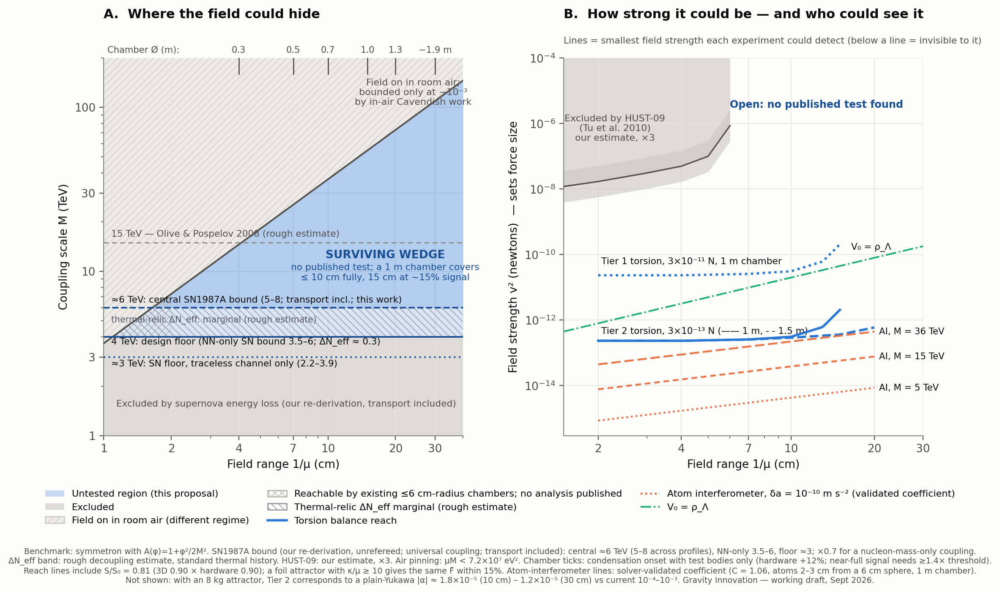

# A Macroscopic-Mass Test of Density-Gated Scalar Fields in a Metre-Scale Open Vacuum

**Working draft for expert critique. Not peer reviewed.** Gravity Innovation (independent project) · v2, September 2026 · Contact: Paul Wilkerson (please open an issue on this repository) · Code and outputs: https://github.com/paulwilkerson1985-cmd/gravity-innovation

*Disclosure:* produced by a non-academic project with extensive AI assistance (Anthropic's Claude, including independent derivations and adversarial internal reviews). Every number here needs expert verification.

---

## Summary

Scalar fields whose vacuum value depends on the size of the empty region around them (symmetrons and their generalizations, environment-dependent dilatons, chameleons) have only been tested in chambers of radius ≲ 6 cm, or with sources outside the vacuum or behind shields. Any such field with a vacuum range above ~2 cm never switches on in existing apparatus.

- **Proposal.** A torsion balance whose source and test bodies share a **≥ 1 m unshielded vacuum**. For the benchmark symmetron (1/μ = 2–30 cm) the force between screened bodies is **independent of the coupling scale M**, and environmental switch tests give a fingerprint no artifact shares. It is the macroscopic-mass extension, one decade up in range, of Clements et al. (2024; Burrage's group), who proposed condensing the symmetron in a 10 cm UHV chamber and detecting its domain walls with atoms or nanobeads at 1/μ = 1–10 mm.
- **Bounds on the benchmark.** SN1987A (our re-derivation): **M ≳ 6 TeV (5–8 across core profiles)** for the universal coupling, ≈ 4.5 TeV (3.8–5.8) for a nucleon-mass-only coupling. A Boltzmann calculation of the thermal relic, against the 2026 BBN+CMB+BAO limit, excludes M ≲ 7.5 TeV (5.9–9.6) for the universal coupling if reheating exceeded a few GeV. Air pinning gives the ceiling M ≤ 3.65 TeV × (1/μ / cm). Surviving wedge: **1/μ ≈ 2–30 cm, M ≳ 7.5 TeV (≳ 6 TeV for any thermal history) up to the ceiling** (Fig. 1A).
- **Publishable either way.** A Tier-1 null gives v² < 2–3×10⁻¹¹ N at 1/μ = 4–10 cm, the first macroscopic-mass bound in the band and about three decades below the only partial constraint (HUST-09); Tier 2 reaches five. Tier 2 also excludes a plausibly open (unverified) corner of the environment-dependent dilaton and, with a heavy attractor, improves inverse-square-law limits at 10–30 cm by ~10–100×.

## 1. The class, the benchmark, and why the regime is untested

**Benchmark.** V(φ) = −μ²φ²/2 + λφ⁴/4, universal coupling A(φ) = 1 + φ²/2M², vacuum value v² = μ²/λ. Between screened bodies F = v² F̃(geometry), 1 eV² ≙ 8.12×10⁻¹³ N.

**Where the field is pinned (φ ≈ 0).** Inside dense matter; in any vacuum below a size threshold (empty cylinder (2.405/R)² + (π/L)² < μ²; with the test bodies our validated solver gives R = L/2 ≈ 3.2–3.7/μ, hardware adds ~12%); in room air if μM < 7.2×10⁷ eV²; behind foils once t ≫ t\* = μM²/ρ ≈ 1.3 µm × (1/μ / cm) for Cu at the air ceiling. Anything solid thicker than ~0.1 mm pins the field; only µm foils and ≤ 20 µm wires are transparent.

**The class.** The threshold belongs to every Z₂-breaking scalar with a quadratic matter coupling (generalized symmetrons, the asymmetron, the dark-matter variant of Burrage et al. 2019). The environment-dependent dilaton (Brax, Fischer, Käding & Pitschmann 2022) has no vacuum threshold, but its force grows with chamber size and vanishes in a 12 cm chamber (§3). The n = 1 dark-energy chameleon gives an M-independent screened-sphere force of 2.4×10⁻¹³ N in a 1 m chamber at ΛDE, just below our Tier 2 (3×10⁻¹³ N), but that region is already excluded for all M (Jaffe et al. 2017; Yin et al. 2022): a cross-check, not new space.

**Desk study (~40 experiments, incl. Heyl 1930 and Overstreet et al. 2022).** Atom interferometers: sources outside the vacuum or chambers of radius ≤ 6 cm. Torsion balances and G measurements: sources outside the vacuum or behind shields; the partial exception, HUST-09 (open-top shield; Tu et al. 2010), excludes only v² ≳ 1–5×10⁻⁸ N at 1/μ ≈ 1.5–4 cm by our 3D model (×3). Casimir, levitated sensors, neutrons, spectroscopy: μ ≳ 0.1 meV or mm-scale cages. The loophole is known (Upadhye 2013; Burrage et al. 2016; Chiow & Yu 2020; Banks, Carlton, Elder, Hird & McCabe 2026 assume a 5 cm vacuum radius); we found no proposal exploiting it with macroscopic masses.

Figure 1. (A) Range versus coupling scale M. Gray: excluded by SN1987A (ours, unrefereed; lines at the central 6 TeV, the NN-only 4 TeV and the traceless-channel 3 TeV). Solid line and hatched band: the ΔNeff bound, 7.5 TeV (5.9–9.6 across the hadronic-rate band) if reheating exceeded a few GeV; the pale region below it survives only with low reheating (and, below 6 TeV, only with the NN-only SN bound). For the nucleon-mass-only operator the SN lines scale by 0.72 and the ΔNeff bound does not apply. Above the diagonal the field is on in room air (μM > 7.2×10⁷ eV²; bounded only at ~10⁻³ by in-air Cavendish work). Cross-hatch: reachable by existing ≤ 6 cm-radius chambers, no analysis published. Top ticks: minimum chamber diameter with the test bodies (hardware +12%). (B) v² versus range: HUST-09 exclusion (ours, ×3); the dark-energy line V₀ = ρΛ; torsion-balance reach (Tier 1: 3×10⁻¹¹ N; Tier 2: 3×10⁻¹³ N, solid 1 m and dashed 1.5 m chamber; S/S₀ = 0.81, membrane loss not included); atom-interferometer reach at δa = 10⁻¹⁰ m s⁻² for M = 8, 15, 36 TeV.

## 2. Bounds on the benchmark

**SN1987A (our re-derivation; companion note).** We bound the universal coupling φ²Tμμ/2M². Olive & Pospelov (2008) obtained M ≳ 15 TeV by assuming an O(1) change of scalar charge per NN collision. Energy–momentum conservation removes monopole and dipole pair emission, suppressing the NN rate by ~9(T/mN)² ≈ 10⁻². The dominant trace channel is fixed at ω → 0 by the Wigner time delay (verified to 0.5% at 10 MeV and 0.1% above 75 MeV with the AV18, Reid93 and Nijmegen-II potentials); with finite-ω matrix elements the trace/traceless ratio is KT = 12 (10–13) (Maxwell–Boltzmann), 6.7–8.1 with Pauli blocking. π⁻p → nφφ is not suppressed and dominates for Yπ ≳ 0.2%. Transport is treated by Monte Carlo.

| Assumption | Bound on M (transport included) |
|---|---|
| Traceless channel only (floor) | ≈ 3 TeV (2.2–3.9) |
| NN only | 3.5 (cold profile) – 6.0 (hot) TeV |
| Central: NN + pions, Yπ ≈ 1% | **5.3–7.9 TeV → "M ≳ 6 TeV (5–8)"**; we would defend 5–6 TeV in print |
| Coupling to nucleon mass only (Olive–Pospelov's operator) | ≈ 0.72× the above: ≈ 4.5 TeV (3.8–5.8) |

The excluded band extends down to 1–2 TeV: a lower bound, not an island. *Credit:* the conservation-law suppression was noted in 2007 for dU = 2 unparticles (Hannestad, Raffelt & Wong; Dutta & Goyal; Freitas & Wyler); the traceless channel is the dilaton low-energy theorem of Hanhart, Phillips, Reddy & Savage (2001). New here: the exact pair identity with its κ-weights, the time-delay trace channel, the pion channel and the transport. Dominant uncertainties: Yπ and in-medium pion physics (×0.75–1.3 in M; Fore et al. 2024 find the π⁻ mass *rises* in neutron-rich matter) and the parametrized profiles (×0.8–1.2).

**Thermal relic (Boltzmann calculation).** In the early-universe symmetric phase the field is light and stays in contact with the plasma through the Tμμ coupling: the gluon trace anomaly above the QCD crossover, ππ → φφ below it (vertex ⟨0|Θ|ππ⟩ = s + 2mπ², Omnès-unitarized). Solving the Boltzmann equation with a lattice equation of state gives ΔNeff = 0.24 (0.14–0.32) at M = 5 TeV, 0.17 (0.10–0.27) at 6 TeV and 0.07 at 10 TeV; φ stays partly coupled through the crossover, so our earlier instantaneous-decoupling estimate was too low above 5 TeV. The 2026 BBN+CMB+BAO limit ΔNeff < 0.107 (95%; Goldstein & Hill 2026) then excludes **M ≲ 7.5 TeV (5.9–9.6 across the hadronic-rate band)** if reheating exceeded a few GeV (6.2–6.6 TeV for TRH ≈ 0.2–0.5 GeV). It drops below the SN bound for TRH ≲ 100 MeV and does not apply to the nucleon-mass-only operator (no pion channel; ΔNeff ≈ 0.06). The dominant uncertainty is the ππ trace form factor at √s ≈ 0.5–1 GeV; CMB-S4 (σ ≈ 0.03) would reach ΔNeff ≈ 0.06, i.e. M ≈ 10 TeV. The Z₂ transition itself (T ~ 100–200 keV) releases ~10⁻¹³ eV⁴ and is inert. Today ρcrit = μ²M² ≈ 5×10⁻³–1 kg m⁻³, so the field is on above ~0–40 km and in space; all bodies being screened and the range ≤ 30 cm, we found no lunar-laser-ranging or satellite bound.

**Naturalness.** δμ² ~ ΛUV⁴/16π²M²: for M = 5–10 TeV, μ = 10⁻⁵ eV the required cancellation is ~10⁻¹⁹ (1 GeV cutoff), 10⁻²⁸ (200 GeV), 10⁻³¹ (1 TeV). The transparent completion, a Higgs portal with λp = mh²/2M² ~ 10⁻⁴, induces mφ ~ GeV. This is the tuning of every laboratory symmetron and chameleon (Upadhye, Hu & Khoury 2012); the mitigation routes in print (Burrage, Copeland & Millington 2016; Burrage et al. 2018) do not reach µeV/TeV. We treat the model as a phenomenological parametrization of a documented blind spot, and the tuning as the honest prior.

## 3. Proposed experiment

**Benchmark signal (validated axisymmetric solver).** Cu spheres of 1 kg and 8.1 kg, centres 14 cm apart, 1 m chamber, 1/μ = 10 cm: F̃ = 1.195 ± 0.005, i.e. δG/G = 4.3×10⁷ × v²[N]. A 3D finite-volume calculation of the dumbbell torque gives 0.90 ± 0.04 of the pairwise proxy; hardware (turntable ≥ 1.5/μ from the bodies) costs a further 9–13%; reach lines use S/S₀ = 0.81 (membrane loss not included).

**Design principle: the screened-body force is set by surface geometry, not mass.** It saturates once the wall exceeds ~10 t\*, while gravity grows with mass. So: **hollow Cu shells** (r = 3 cm, 2 mm wall, 0.2 kg) as test bodies and **Cu foil disks** (r = 5 cm; 23–68 µm, 1.6–4.8 g at M = 15 TeV) 4 cm away as the attractor. The foil pulls the shell with 1.04–1.29 v² (the 8.1 kg sphere at 14 cm gives 1.20 v²) with a Newtonian pull of 3–10×10⁻¹² N: **13–30× the Tier-2 signal instead of ~10⁵×**. A foil-thickness series separates the two (Fscalar saturates, FN ∝ t) and measures M; the high-M edge needs 130 µm at 36 TeV.

**Tiers.** Tier 1: 3×10⁻¹¹ N (borrowed ≥ 1 m chamber; ≈ $100–130k, one student-year). Tier 2: 3×10⁻¹³ N (established torsion-balance group; thermal-noise SNR ≈ 40 per hour).

**Electrostatic baseline.** A permanent, grounded, **full-width 2 µm Al-Mylar membrane** between attractor and pendulum screens DC fields at 95–99%. As a Robin sheet it has κ/μ ≈ 0.14 × (1/μ / 10 cm)(15 TeV/M)²: ≈ 11% signal loss at the benchmark (10 cm, 15 TeV) and ≲ 12% wherever M ≳ 5 TeV × √(1/μ / cm), but 17% (4 cm), 37% (10 cm) and 75% (30 cm) along the 7.5 TeV floor, where a thinner film (0.9 µm Mylar + 30 nm Au, ×0.63 in κ) is needed. It must span the chamber (a framed 1.5/μ membrane halves the signal). Bias nulling and Au surfaces are the check; Tier 2 needs ΔV ≲ 30 mV.

**Switch: liner or end plates.** An open tube of radius 2.8/μ around the pendulum axis, or end plates moved from the chamber ends to ±1.5/μ, drives the field to zero with every mass fixed, Newtonian-neutral by symmetry, no gas. Run liner-in/out with the attractor running: the attractor-synchronous torque is Newtonian + scalar (out) versus Newtonian only (in), so the Newtonian part cancels to the geometric reproducibility. A one-sided movable foil is *not* a switch: it pulls the test body with 1.2–1.5 v² of its own.

**Fingerprint.** A genuine signal must pass all of: (1) liner switch: zero below threshold; (2) foil-thickness saturation curve (M); (3) gas shape test, Tier 1 only: S/S₀ ≈ (1 − ρ/0.584 ρcrit)^1.15, vanishing at ρ = 0.584 μ²M² (second M handle), identical for He and Xe at matched *mass* density; a lateral 1 mK gradient across 1 m drives convection torques ~70× Tier 1, so this is a shape test, not a modulation; (4) composition independence (Al vs W) to O(μ/min) ≈ 1–2%; (5) distance law: 10.9× fall from 14 to 30 cm in the benchmark geometry versus 4.6× Newtonian; (6) domain walls: none metastable at chamber radius 5–7/μ (our choice); at ≥ 8/μ a pinned wall changes the force by 3–5% and gives a bimodal run-to-run distribution. Systematics: patch potentials (large-scale Volta variation of the rotating source, insulator charging), foil–shell distance drift, gas-run radiometric forces, tilt, seismic noise.

**Reach and by-products.** A Tier-1 null: v² < 2.3 / 2.6 / 3.1×10⁻¹¹ N at 1/μ = 4 / 7 / 10 cm, reaching the dark-energy line V₀ = ρΛ (v² = 2×10⁻¹¹ N × (1/μ / 10 cm)²) near 1/μ ≈ 10 cm; Tier 2 is 100× lower. **Dilaton:** solving the Liouville equation for V = V₀e^{−λφ/MPl}, A = 1 + A₂φ²/2MPl² on the same grid with V₀ = ρΛ, the benchmark force peaks at 1.2×10⁻¹¹ N at λ = 10²⁷ (3×10⁻¹¹ N in a 2 m chamber), and Tier 2 excludes 5×10²⁵ ≲ λ ≲ 2.5×10²⁸ for A₂ ≳ 10²⁸(λ/10²⁷)² (Meff ≲ 25 TeV). Published dilaton plots resolve A₂ ~ 10⁴⁰ and the cosmological subspace, not this corner: plausibly open, unverified. **Inverse-square law:** with the 8 kg attractor, Tier 2 corresponds to |α| ≈ 1.8×10⁻⁵ (λ = 10 cm) and 1.2×10⁻⁵ (30 cm) against current ~10⁻⁴–10⁻³ (Hoskins et al. 1985; Adelberger, Heckel & Nelson 2003); Tier 1 is comparable to existing limits. **Atom interferometry (coefficient validated):** unscreened atoms feel a = C · 1.8×10⁻⁸ m s⁻² · (v²/eV²)(10 cm/(1/μ))(5 TeV/M)², C = 1.06 at 2–3 cm above a 6 cm sphere in a 1 m chamber, giving v²min = 4.3×10⁻¹⁵ N × (1/μ / 10 cm)(M/5 TeV)² at δa = 10⁻¹⁰ m s⁻². The interferometer covers the low-M part of the wedge (M ≲ 40 TeV at 10 cm), the M-independent balance the high-M part; they want different attractors (compact sphere versus foil).

## 4. Caveats

Nothing here is refereed: the SN and ΔNeff analyses are ours (the latter assumes a standard thermal history), and the dilaton corner is unverified. The prior probability of a detection is well under 1%, set by the naturalness numbers; the value is a publishable exclusion of a documented gap, the two by-products, and the technique. A positive result would be a new force with metrological uses (a calculable, switchable reference force: ≤ 10⁻⁵ N, attractive, two-body and vacuum-only).

## 5. What we ask

A 30-minute call or an email on three points: (1) **Solver check:** run SELCIE (or your own code) on the benchmark (Cu spheres 1 kg and 8.1 kg, centres 14 cm apart, 1 m × 1 m cylinder, 1/μ = 10 cm; we get F̃ = 1.195 ± 0.005 for the force on the 1 kg test sphere) and on the membrane case (a full-width Robin sheet with κ/μ = 0.1 midway between the sphere surfaces: 7.8% loss; real 2 µm Al-Mylar at 15 TeV is κ/μ ≈ 0.14, ≈ 11%); our repository reproduces both in under a minute. (2) **Missed experiments:** any experiment or proposal with two screened bodies sharing an unshielded vacuum larger than ~7/μ at 1/μ ≳ 2 cm? (3) **The dilaton corner:** is (λ ~ 10²⁶–10²⁸, A₂ ~ 10²⁸–10³¹) already excluded?

## Key references

Clements et al., PRD 109, 123023 (2024) · Hinterbichler & Khoury, PRL 104, 231301 (2010) · Upadhye, PRL 110, 031301 (2013) · Upadhye, Hu & Khoury, PRL 109, 041301 (2012) · Burrage, Kuribayashi-Coleman, Stevenson & Thrussell, JCAP 12 (2016) 041; Burrage et al., arXiv:1604.06051; 1804.07180; 1811.12301 · Brax, Fischer, Käding & Pitschmann, arXiv:2203.12512 · Fischer, Käding & Pitschmann, Universe 10, 297 (2024) · Chiow & Yu, PRD 101, 083501 (2020) · Banks, Carlton, Elder, Hird & McCabe, PRD 113, 084047 (2026) · Jaffe et al., Nat. Phys. 13, 938 (2017) · Yin et al., Nat. Phys. 18, 1181 (2022) · Tu et al., PRD 82, 022001 (2010) · Hoskins et al., PRD 32, 3084 (1985) · Adelberger, Heckel & Nelson, ARNPS 53, 77 (2003) · Olive & Pospelov, PRD 77, 043524 (2008) · Hanhart et al., Nucl. Phys. B 595, 335 (2001) · Hannestad, Raffelt & Wong, arXiv:0708.1404 · Dutta & Goyal, arXiv:0712.0145 · Freitas & Wyler, arXiv:0708.4339 · Fore & Reddy, PRC 101, 035809 (2020) · Fore, Kaiser, Reddy & Warrington, PRC 110, 025803 (2024) · Goldstein & Hill, PRD 114, L021305 (2026) · Donoghue, Gasser & Leutwyler, Nucl. Phys. B 343, 341 (1990) · Saikawa & Shirai, JCAP 05 (2018) 035

